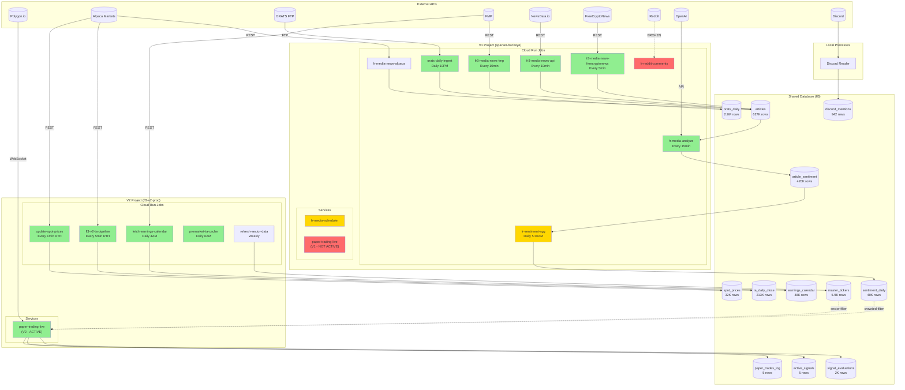

# Master Data Flow Diagram
**Generated**: 2026-02-04

## Overview

This document maps all data flows across V1 (spartan-buckeye) and V2 (fl3-v2-prod) projects, showing how data moves from external APIs through processing to consumption.

---

## Architecture Diagram (Mermaid)



---

## Pipeline Status Summary

### Active & Healthy (Green)

| Pipeline | Project | Scheduler | Destination | Status |
|----------|---------|-----------|-------------|--------|
| ORATS Daily Ingest | V1 | Daily 10PM | `orats_daily` | Working |
| FMP News | V1 | Every 10min | `articles` | Working |
| NewsData News | V1 | Every 10min | `articles` | Working |
| FreeCryptoNews | V1 | Every 5min | `articles` | Working |
| Media Analyze | V1 | Every 15min | `article_sentiment`, `article_insights` | Working |
| TA Pipeline | V2 | Every 5min RTH | `ta_daily_close`, `ta_snapshots_v2` | Working |
| Spot Prices | V2 | Every 1min RTH | `spot_prices` | Working |
| Earnings Calendar | V2 | Daily 4AM | `earnings_calendar` | Working |
| Premarket TA Cache | V2 | Daily 6AM | `ta_daily_close` | Working |
| Sector Data Refresh | V2 | Weekly | `master_tickers` | Working |
| Paper Trading | V2 | Continuous | `signal_evaluations`, `active_signals`, `paper_trades_log` | Working |
| Discord Reader | Local | Continuous | `discord_mentions` | Working |

### Degraded (Yellow)

| Pipeline | Project | Issue | Impact |
|----------|---------|-------|--------|
| Sentiment Aggregation | V1 | `fr-sentiment-agg` job failing | `sentiment_daily` 14 days stale |
| Media Scheduler | V1 | Running on stale revision | May affect job orchestration |

### Broken/Inactive (Red)

| Pipeline | Project | Issue | Impact |
|----------|---------|-------|--------|
| Reddit Ingest | V1 | Stopped Jan 31, 2026 | No Reddit data flowing |
| ORATS Top 50 | V1 | Job failing | None - V2 doesn't use it |
| Paper Trading (V1) | V1 | Uses different Alpaca account | Confusion - should be deleted |

### Not Integrated (Gray)

| Component | Status | Notes |
|-----------|--------|-------|
| `intraday_baselines_30m` | Data accumulates but never read | `load_baselines()` never called |
| `earnings_calendar` | Populated but not queried | Earnings filter not implemented in V2 |
| `ta_daily_close` | Populated but not queried in live | V2 fetches TA from Polygon API directly |

---

## Cross-Project Data Dependencies

### Critical Path: V1 → V2

```
V1 Media Pipeline:
  articles → article_sentiment → fr-sentiment-agg → sentiment_daily
                                                            │
                                                            ▼
                                          V2 paper-trading-live
                                          (crowded trade filter)
```

**This is the ONLY V1→V2 live dependency, and it's BROKEN (sentiment_daily is 14 days stale)**

### V2 Internal Dependencies

```
V2 Pipelines → Shared Database → V2 Paper Trading

  update-spot-prices → spot_prices ← (not currently queried)
  fetch-earnings-calendar → earnings_calendar ← (not currently queried)
  refresh-sector-data → master_tickers ← sector concentration filter
  premarket-ta-cache → ta_daily_close ← (not queried - uses Polygon API)
```

### V1 Internal Dependencies

```
V1 Media Pipeline (self-contained):

  News APIs → articles → fr-media-analyze → article_sentiment
                                                    │
                                                    ▼
                                           fr-sentiment-agg
                                                    │
                                                    ▼
                                           sentiment_daily
```

---

## Table Write Ownership

| Table | Primary Writer | Secondary Writer |
|-------|----------------|------------------|
| `orats_daily` | V1 `orats-daily-ingest` | None |
| `articles` | V1 news jobs (4 sources) | None |
| `article_sentiment` | V1 `fr-media-analyze` | None |
| `sentiment_daily` | V1 `fr-sentiment-agg` | None |
| `ta_daily_close` | V2 `premarket-ta-cache` | None |
| `spot_prices` | V2 `update-spot-prices` | None |
| `earnings_calendar` | V2 `fetch-earnings-calendar` | None |
| `master_tickers` | V2 `refresh-sector-data` | V1 sync scripts |
| `signal_evaluations` | V2 `paper-trading-live` | None |
| `active_signals` | V2 `paper-trading-live` | None |
| `paper_trades_log` | V2 `paper-trading-live` | None |
| `discord_mentions` | Local Discord reader | None |

---

## Data Freshness Requirements

| Table | Required Freshness | Current Status | Consumer |
|-------|-------------------|----------------|----------|
| `sentiment_daily` | Daily | 14 days stale | V2 paper trading |
| `master_tickers` | Weekly | Current | V2 paper trading |
| `spot_prices` | 1 minute | Current | V2 paper trading (not queried) |
| `earnings_calendar` | Daily | Current | V2 paper trading (not queried) |
| `ta_daily_close` | Daily | Current | V2 paper trading (not queried) |
| `orats_daily` | Daily | Current | V2 backtesting only |
